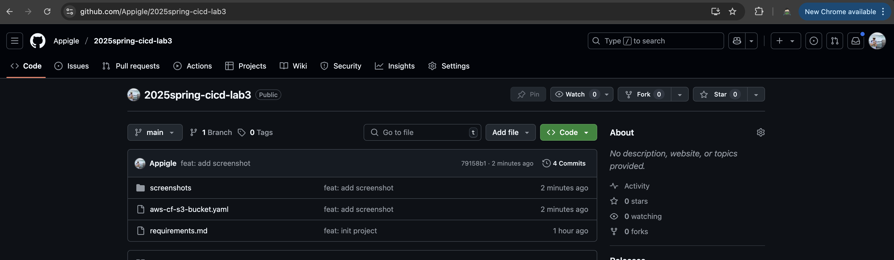
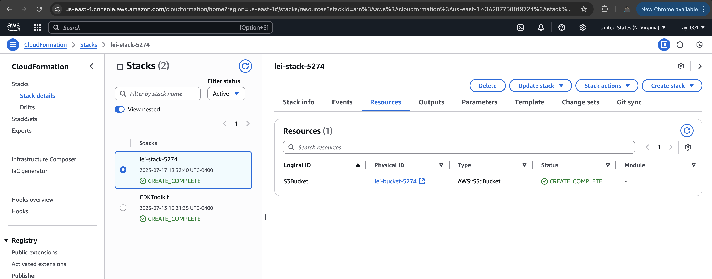
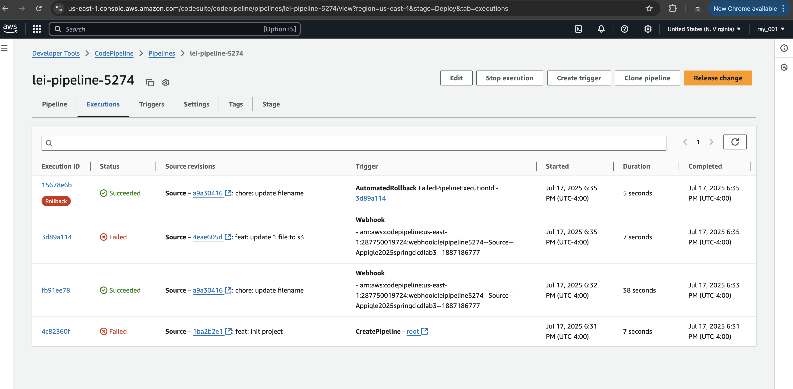
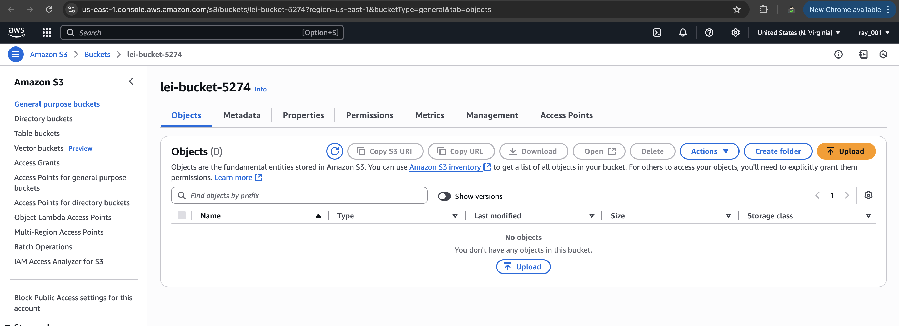
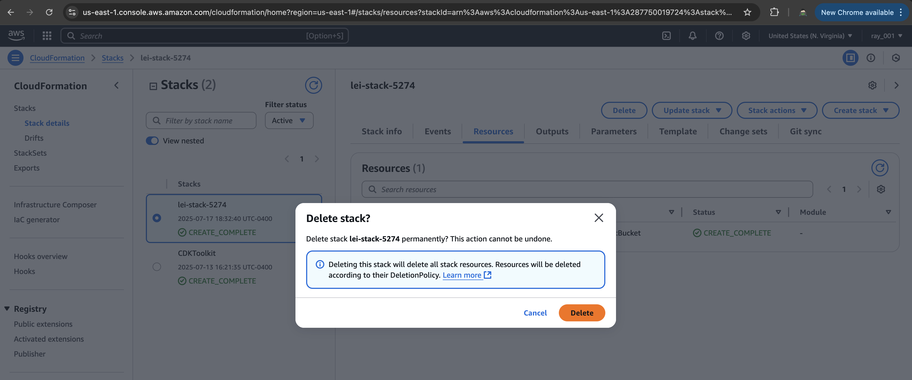

# Lab 3 - AWS CloudFormation + CodePipeline

**Automated Infrastructure Deployment with AWS CloudFormation and CodePipeline**

## Project Overview

This project demonstrates setting up a complete CI/CD pipeline using AWS CodePipeline that automatically provisions AWS resources using CloudFormation. The pipeline monitors a GitHub repository and deploys infrastructure changes automatically when code is pushed.

## Architecture

```
GitHub Repository (main branch)
        ↓
    CodePipeline
        ↓
   Source Stage (GitHub)
        ↓
   Deploy Stage (CloudFormation)
        ↓
    S3 Bucket Creation
```

## 📁 Project Structure

```
lab03/
├── aws-cf-s3-bucket.yaml    # CloudFormation template
├── requirements.md          # Lab requirements
└── README.md               # This documentation
└── screenshots
```

## Setup Instructions

### Prerequisites

- AWS Account with appropriate permissions
- GitHub account
- AWS CLI configured (optional for local validation)

### Step 1: CloudFormation Template

The `aws-cf-s3-bucket.yaml` template creates:

- **S3 Bucket**: `lei-bucket-5274` with configurable versioning
- **Parameters**: Bucket name and versioning configuration

### Step 2: GitHub Repository

1. Create GitHub repository: `2025spring-cicd-lab3`
2. Push CloudFormation template to `main` branch
   

## Usage Instructions

### Automatic Deployment

1. Make changes to `aws-cf-s3-bucket.yaml`
2. Commit and push to `main` branch
3. CodePipeline automatically triggers
4. Monitor pipeline progress in AWS Console

### Manual Pipeline Execution

1. Navigate to AWS CodePipeline Console
2. Select `lei-pipeline-5274`
3. Click "Release change"

### Testing Changes

To test the pipeline:

1. Modify CloudFormation template (e.g., add tags, change settings)
2. Push changes to GitHub
3. Observe automatic pipeline execution
4. Verify changes in AWS S3 Console





## Cleanup Instructions

### Delete Resources (Important!)

1. **Delete S3 Bucket** (if not empty):

   ```bash
   aws s3 rm s3://lei-bucket-5274 --recursive
   aws s3 rb s3://lei-bucket-5274
   ```

2. **Delete CloudFormation Stack**:

   - Go to CloudFormation Console
   - Select your stack
   - Click "Delete"

3. **Delete CodePipeline** (optional):
   - Go to CodePipeline Console
   - Select `lei-pipeline-5274`
   - Click "Settings" → "Delete pipeline"



### Validation Commands

```bash
# Validate CloudFormation template locally
aws cloudformation validate-template --template-body file://aws-cf-s3-bucket.yaml

# Check S3 bucket
aws s3 ls s3://lei-bucket-5274

# List CloudFormation stacks
aws cloudformation list-stacks --stack-status-filter CREATE_COMPLETE UPDATE_COMPLETE
```
